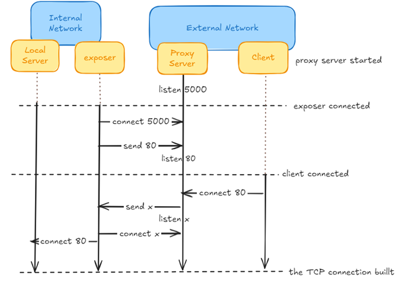

# Reverse Proxy

A reverse proxy allows you to expose a local server that is located behind a NAT or firewall to the Internet [[1]](https://github.com/fatedier/frp). It currently supports TCP-based protocols, enabling requests to be forwarded to internal services via domain name or IP address.

## Related Work
* [nginx](https://nginx.org/) ("engine x") is an HTTP web server, reverse proxy, content cache, load balancer, and TCP/UDP proxy server.
  However, it becomes useless when the local port cannot be directly exposed.
* Unlike [ngrok](https://ngrok.com/), this solution allows the proxy server to be deployed anywhere, reducing propagation delay compared to ngrok's centralized global service.
* [`ssh -R`](https://linux.die.net/man/1/ssh) forwards given port on the remote (server) host to the given host and port on the local side.
  However, if sshd doesn't set [GatewayPorts](https://linux.die.net/man/5/sshd_config), only loopback addresses can be bound at the remote host, thus prohibiting other hosts from connecting.
* The bind operation in [SOCKS](https://www.openssh.com/txt/socks4.protocol) allows binding a local port to the proxy,
  but it requires rebinding the port each time a new client connects.
* This solution is a C++ implementation of [frp](https://github.com/fatedier/frp), so you don't need to install or run the Go runtime.

## How It Works

This app does not directly forward traffic to your upstream services using IP addresses. Instead, you run a small piece of software alongside your service, called an *exposer*. The exposer establishes TCP connections to the proxy server. When traffic reaches your endpoints at the proxy server, it is transmitted to the exposer through these connections, and finally forwarded to your upstream service [[2]](https://ngrok.com/docs/how-ngrok-works/).


。


## 🚀 Build and Run

### 1️⃣ Install Dependencies

#### Linux (Ubuntu/Debian)

```bash
sudo apt update

# Minimal Boost for your C++ project
sudo apt install -y g++ make libboost-system-dev libboost-thread-dev

# Static analysis & formatting tools
sudo apt install -y cppcheck clang-format
```

---

### 2️⃣ Configure the Build

```bash
# Create a build/ folder at the project root
mkdir build && cd build

# Generate the build configuration
cmake ..
```

---

### 3️⃣ Compile

#### 🔹 Linux / macOS

```bash
# Build all executables
cmake --build .
```

#### 🔹 Windows (MSVC)

```powershell
# Build for Release
cmake --build . --config Release

# Build for Debug
cmake --build . --config Debug
```

---

### 4️⃣ Run the Proxy Server

```bash
./proxy_server 5000
```

---

### 5️⃣ Run the Exposer

```bash
export PROXY_HOST=<your_proxy_server_ip>:5000
./expose 80:80
```

